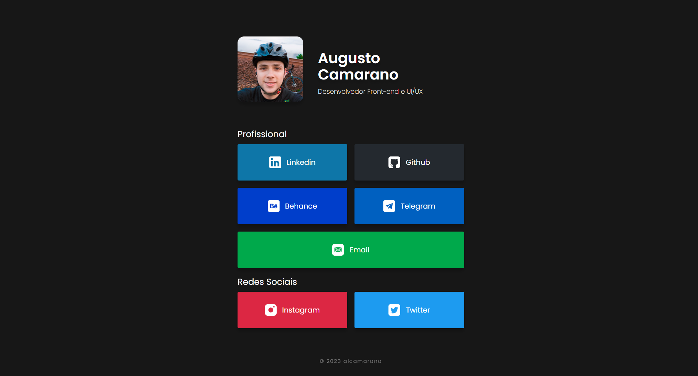

<h1 align="center">Bio // alcamarano</h1>

<h4 align="center"><a href="" target="_blank">Clique para visitar o projeto</a></h4>

<h2>Autor</h2>
<table>
  <tr>
    <td align="center">
      <a href="https://github.com/alcamarano">
         
        
          <b>Augusto L. Camarano</b>
        
      </a>
    </td>
  </tr>
</table>
